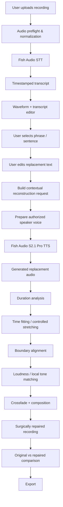
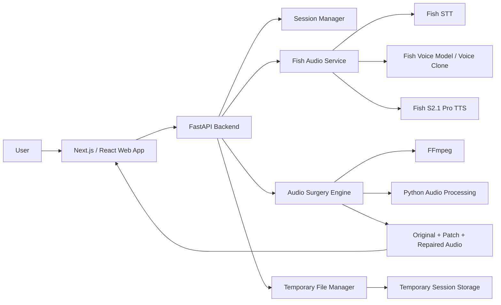
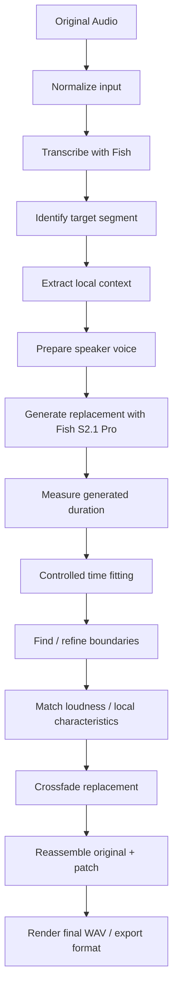

# Speech Surgeon

> **Edit what you said without saying it again.**

Speech Surgeon is an AI-powered spoken-audio editing tool designed to repair small mistakes in an existing recording without requiring the speaker to record the changed part again.

The core idea is simple:

1. Upload a spoken recording.
2. Transcribe it into an editable, timestamped transcript.
3. Select the sentence or phrase that needs to change.
4. Replace the text.
5. Reconstruct the edited speech using the original speaker's voice.
6. Surgically fit the generated audio into the original recording.
7. Compare the original and repaired versions.
8. Export the repaired recording.

Speech Surgeon is **not** another text-to-speech wrapper. The goal is to make recorded speech behave more like an editable digital medium: instead of rerecording an entire take because of one mistake, the user can change the local spoken content and preserve the rest of the performance.

---

## The Problem

Spoken content is often almost impossible to revise cleanly after recording.

A creator, podcaster, journalist, teacher, interviewer, or marketing team may finish a recording and discover that one sentence contains:

- an incorrect date
- the wrong product name
- an outdated price
- a factual correction
- a missed phrase
- a pronunciation mistake
- a small script change
- a wording change requested after recording

With a traditional workflow, the options are usually:

- record the sentence again
- schedule another recording session
- cut around the mistake
- accept an obvious audio patch
- regenerate an entire voiceover and lose the original performance

Speech Surgeon explores a different workflow:

```text
Record once
    ↓
Find the mistake
    ↓
Edit the words
    ↓
Reconstruct only the changed speech
    ↓
Blend it into the original
    ↓
Keep everything else untouched
```

### Example

Original:

> “We launched the product in **March**.”

Edited:

> “We launched the product in **September**.”

The user should not need to record the sentence again.

---

## Product Vision

Speech Surgeon is based on a simple product thesis:

> **If text can be edited after writing and images can be edited after capture, spoken recordings should also be editable after recording.**

The long-term direction is to treat speech as an editable artifact with:

- text-level edits
- performance edits
- localized edits
- versions
- history
- precise reconstruction
- eventually, video-aware repair

The first version intentionally solves a much narrower problem: **high-quality phrase/sentence repair in a clean, single-speaker recording.**

---

## What Makes Speech Surgeon Different

Speech Surgeon is deliberately positioned between a speech model and a full audio editor.

### [Fish Audio](https://github.com/fishaudio) provides the speech intelligence

Fish Audio is used for the parts that require high-quality speech understanding and speech generation:

- speech-to-text
- timestamped transcription
- private voice-model / voice-cloning workflows
- expressive speech synthesis
- speaker identity reconstruction

### Speech Surgeon provides the editing layer

Speech Surgeon is responsible for:

- mapping transcript segments back to audio regions
- letting the user edit the spoken content
- selecting the correct source region
- constructing contextual generation input
- deciding what should be regenerated
- fitting generated audio to the source timing
- handling boundaries and transitions
- matching loudness and local characteristics
- rebuilding the final recording
- visualizing exactly what changed
- keeping the original recording intact

The central product value therefore comes from the combination:

```text
                 FISH AUDIO
                     │
       ┌─────────────┼─────────────┐
       │             │             │
      STT       Voice Identity     TTS
       │             │             │
       └─────────────┼─────────────┘
                     │
                     ▼
               SPEECH SURGEON
                     │
       ┌─────────────┼─────────────┐
       │             │             │
     ALIGN         EDIT          PATCH
       │             │             │
       └─────────────┼─────────────┘
                     │
                     ▼
              REPAIRED RECORDING
```

---

# End-to-End Product Flow



---

# System Architecture



---

# User Experience

Speech Surgeon intentionally keeps the product surface small.

The primary experience is composed of three major states.

## 1. Upload

The user sees:

> **Speech Surgeon**  
> Edit what you said without saying it again.

Then a simple upload area:

```text
┌────────────────────────────────────────────┐
│                                            │
│          Drop your recording here          │
│                                            │
│             WAV · MP3 · M4A                │
│                                            │
│              [ Analyze ]                   │
│                                            │
└────────────────────────────────────────────┘
```

The first version should favor short, clean, single-speaker recordings so the reconstruction problem remains well controlled.

---

## 2. Edit

After transcription, the application presents:

- waveform
- playback controls
- timestamped transcript
- selectable segments
- editable replacement text
- surgery controls

Conceptually:

```text
┌────────────────────────────────────────────────────┐
│ SPEECH SURGEON                                     │
│                                                    │
│  ▶ ───────────────●───────────────────────        │
│    00:04                              00:12        │
│                                                    │
│  We launched the product in March.                 │
│                                 ^^^^^              │
│                                                    │
│  Replace with                                      │
│  [ We launched the product in September. ]         │
│                                                    │
│                 [ SURGERIZE ]                      │
└────────────────────────────────────────────────────┘
```

The user should not need to understand the underlying AI workflow.

They are simply editing what they want the recording to say.

---

## 3. Result

After the surgery is complete, the user receives a focused A/B comparison:

```text
┌──────────────────────────────────┐
│ ORIGINAL                         │
│ ▶ “We launched in March.”        │
└──────────────────────────────────┘

                VS

┌──────────────────────────────────┐
│ SURGICALLY REPAIRED              │
│ ▶ “We launched in September.”   │
└──────────────────────────────────┘

Changed: 1 segment

[ PLAY ORIGINAL ]   [ PLAY REPAIRED ]

               [ EXPORT ]
```

The interface should clearly show that the rest of the recording was preserved.

---

# Why Phrase / Sentence Surgery Comes First

The first release intentionally focuses on phrase or sentence replacement rather than promising arbitrary word-level editing.

A user might visually change:

```text
March → September
```

but the underlying system can regenerate the surrounding phrase or sentence:

```text
“We launched the product in September.”
```

This provides the speech model with linguistic context and gives the audio pipeline a more coherent unit to reconstruct.

True word-level surgery is a harder problem because the replacement may differ substantially in:

- duration
- phonetic context
- stress
- coarticulation
- sentence rhythm
- prosody

Word-level surgery is therefore considered a future alignment and reconstruction enhancement rather than a requirement for the first release.

---

# Technical Architecture

## Frontend

### Next.js

The web application is planned with:

- Next.js
- React
- TypeScript

Responsibilities:

- upload interface
- waveform rendering
- transcript rendering
- transcript editing
- segment selection
- surgery controls
- processing status
- audio comparison
- export

### Tailwind CSS

Used for application styling and responsive layout.

### shadcn/ui

Used for reusable interface components such as:

- buttons
- inputs
- dialogs
- tabs
- tooltips
- status indicators
- progress states

### wavesurfer.js

Used for:

- waveform visualization
- playback
- seeking
- region selection
- changed-region highlighting

---

# Backend

## Python + FastAPI

FastAPI acts as the orchestration layer between the browser, Fish Audio, and the audio-processing system.

The browser must not receive the Fish API key.

```text
Browser
   ↓
Speech Surgeon API
   ↓
Fish Audio
```

Backend responsibilities include:

- session management
- upload handling
- audio preflight
- audio normalization
- Fish API calls
- transcript normalization
- voice-model preparation
- surgery orchestration
- audio rendering
- file cleanup
- error handling

---

# Fish Audio Integration

Speech Surgeon is built around three primary Fish capabilities for the MVP.

## 1. Fish Speech-to-Text

The recording is sent through Fish's speech recognition API to obtain transcript content and timing information.

The Fish API exposes an ASR endpoint capable of returning timestamped segments when timestamping is enabled.

Conceptually:

```json
{
  "text": "We launched the product in March.",
  "start": 4.21,
  "end": 7.34
}
```

Documentation:

- https://docs.fish.audio/api-reference/endpoint/openapi-v1/speech-to-text

The application converts the provider response into its own normalized transcript representation rather than coupling the frontend directly to the provider response format.

---

## 2. Fish Voice Model / Voice Cloning

Speech Surgeon needs a way to reconstruct the changed speech while preserving the identity of the original speaker.

The planned approach is to create or use a private voice model from an authorized voice reference extracted from the uploaded recording.

The Fish API documents private model creation and fast voice-model creation workflows.

Documentation:

- https://docs.fish.audio/api-reference/endpoint/model/create-model

Voice assets should be treated as session-scoped material in the MVP.

---

## 3. Fish S2.1 Pro TTS

Fish S2.1 Pro is used to synthesize the edited phrase using the prepared speaker voice.

The current Fish TTS API supports a voice `reference_id` or reference audio and exposes expressive/prosody-related controls.

Documentation:

- https://docs.fish.audio/api-reference/endpoint/openapi-v1/text-to-speech

Model documentation:

- https://docs.fish.audio/developer-guide/models-pricing/models-overview

The generation should be contextual rather than blindly synthesizing a single replacement word whenever possible.

---

# Fish API Responsibilities vs Application Responsibilities

| Stage | Speech Surgeon | Fish Audio |
|---|---|---|
| Upload | ✅ | |
| File validation | ✅ | |
| Audio normalization | ✅ | |
| Speech recognition | | ✅ |
| Timestamped transcript | | ✅ |
| Transcript editor | ✅ | |
| User edit | ✅ | |
| Voice preparation | | ✅ |
| Voice reconstruction | | ✅ |
| TTS generation | | ✅ |
| Duration analysis | ✅ | |
| Timing fit | ✅ | |
| Boundary handling | ✅ | |
| Crossfade | ✅ | |
| Loudness matching | ✅ | |
| Final composition | ✅ | |
| Original/repaired comparison | ✅ | |
| Export | ✅ | |

The boundary is intentional: **Fish provides speech intelligence; Speech Surgeon provides the surgical editing workflow.**

---

# Audio Pipeline

The core audio pipeline is the most important technical part of the project.



---

# Audio Preflight

Before sending the recording into the core pipeline, Speech Surgeon should inspect:

- duration
- sample rate
- number of channels
- file format
- basic silence profile
- rough speech/noise characteristics

Inputs can be normalized into a predictable internal format before downstream processing.

A controlled internal representation makes the rest of the audio pipeline easier to test.

The MVP should prefer:

- one speaker
- clear speech
- limited background noise
- limited reverberation
- no overlapping speakers

---

# Voice Reference Preparation

A speaker reference is needed to reconstruct the changed speech.

The target flow is:

```text
Original recording
      ↓
Find clean speech region
      ↓
Create temporary voice reference
      ↓
Create / use private Fish voice model
      ↓
Use model for replacement generation
```

The long-term UX should make this invisible to the user.

The intended interaction is simply:

> **Use the voice from this recording.**

The system handles the reference preparation internally.

---

# Contextual Reconstruction

The system should preserve enough local linguistic context when generating the replacement.

For example, instead of asking the model to generate:

```text
September
```

it may be better to reconstruct:

```text
We launched the product in September.
```

and then replace the corresponding source region.

This provides the synthesis model with more context for:

- rhythm
- pronunciation
- sentence-level prosody
- transitions
- natural phrasing

The exact context-window strategy can evolve after listening tests.

---

# Duration Matching

Generated speech will not necessarily have the same duration as the original segment.

Example:

```text
Original selected segment:   2.14 sec
Generated replacement:       2.48 sec
```

Speech Surgeon should therefore calculate a duration ratio and apply controlled timing adjustment.

A practical first approach is:

```text
ratio = target_duration / generated_duration
```

Extreme adjustments should not be forced.

If the replacement is substantially longer or shorter than the source, the UI can encourage the user to use a more compact phrase.

Example:

> **This edit changes the rhythm substantially. Try a shorter replacement for a more natural result.**

---

# Boundary Handling

Exact ASR boundaries are useful but are not necessarily perfect splice points.

Speech Surgeon should be able to use small amounts of contextual padding around the selected segment and refine the final transition point using local audio characteristics.

The goal is to avoid an obvious:

```text
ORIGINAL → AI PATCH → ORIGINAL
```

sound.

The desired result is:

```text
ORIGINAL → seamless continuation → ORIGINAL
```

---

# Crossfading

A hard cut between original and generated speech may expose tiny differences in phase, room tone, pitch, or level.

Speech Surgeon therefore uses short crossfades when reconstructing the region.

The exact duration of the crossfade should be tuned empirically using the evaluation set.

---

# Loudness Matching

The synthesized patch may be slightly louder or quieter than the source recording.

Before insertion, the audio engine should compare local source characteristics and adjust patch gain so the transition does not create an obvious level jump.

Later iterations may also include more advanced local spectral/tone matching.

---

# Audio File Strategy

The original recording should never be overwritten.

A session may contain:

```text
session_xxx/
├── original.wav
├── normalized.wav
├── transcript.json
├── reference.wav
├── patch_01.wav
└── repaired_01.wav
```

The principle is:

> **Original source is immutable; surgeries produce new versions.**

This also creates a foundation for future version history.

---

# Proposed Internal API

The browser should communicate with application-level endpoints rather than directly exposing Fish API contracts.

```text
POST   /api/sessions
POST   /api/sessions/:id/upload
POST   /api/sessions/:id/transcribe
POST   /api/sessions/:id/voice
POST   /api/sessions/:id/surgery

GET    /api/sessions/:id
GET    /api/sessions/:id/audio/original
GET    /api/sessions/:id/audio/repaired

DELETE /api/sessions/:id
```

These endpoints are an architectural starting point and can evolve as implementation details become clearer.

---

# Session State

A session can progress through a controlled state machine:

```text
CREATED
   ↓
UPLOADED
   ↓
PREPROCESSED
   ↓
TRANSCRIBING
   ↓
TRANSCRIBED
   ↓
VOICE_READY
   ↓
READY_TO_EDIT
   ↓
SURGERIZING
   ↓
RENDERING
   ↓
READY
```

Failure states should be explicit:

```text
ERROR_UPLOAD
ERROR_TRANSCRIPTION
ERROR_VOICE
ERROR_TTS
ERROR_RENDER
```

This prevents the UI from getting stuck on generic loading states.

---

# Planned Repository Structure

```text
speech-surgeon/
├── apps/
│   └── web/
│       ├── app/
│       ├── components/
│       ├── hooks/
│       └── lib/
│
├── services/
│   └── api/
│       ├── routes/
│       ├── services/
│       │   ├── fish/
│       │   ├── audio/
│       │   └── surgery/
│       ├── models/
│       └── utils/
│
├── audio/
│   ├── preprocessing/
│   ├── alignment/
│   ├── rendering/
│   └── mixing/
│
├── tests/
│   ├── audio/
│   ├── surgery/
│   └── api/
│
├── docs/
│   └── architecture/
│
├── .env.example
├── README.md
└── LICENSE
```

The final structure may change during implementation, but the main separation should remain:

```text
Web UI
   ↓
API orchestration
   ↓
Fish integration
   +
Audio surgery engine
```

---

# Technology Stack

| Layer | Technology | Purpose |
|---|---|---|
| Web framework | Next.js | Frontend application |
| UI | React | Interactive interface |
| Language | TypeScript | Frontend type safety |
| Styling | Tailwind CSS | UI styling |
| Components | shadcn/ui | Reusable interface primitives |
| Waveform | wavesurfer.js | Audio visualization and regions |
| Backend | Python + FastAPI | API and orchestration |
| Audio CLI | FFmpeg | Conversion, composition, export |
| Audio processing | Python audio tooling | Analysis and signal processing |
| Speech recognition | Fish Audio STT | Transcript generation |
| Voice reconstruction | Fish Audio voice model | Speaker identity |
| Speech synthesis | Fish Audio S2.1 Pro | Replacement speech generation |
| MVP storage | Temporary files | Session-scoped audio assets |
| Future storage | S3/R2-compatible object storage | Persistent project assets |
| Future database | PostgreSQL | Persistent projects/version history |

---

# MVP Scope

## Supported

- clean spoken recordings
- single speaker
- short sessions
- phrase/sentence replacement
- same-language editing
- authorized speaker voice reconstruction
- waveform + transcript editing
- original/repaired A/B comparison
- downloadable output

## Not part of the first version

- multiple overlapping speakers
- arbitrary noisy environments
- music-heavy recordings
- full digital audio workstation functionality
- unrestricted word-level replacement
- automatic fact checking
- automatic script correction
- full video editing
- multilingual surgery
- public voice marketplace
- account/team management
- billing
- social sharing inside the application

These are intentionally deferred so the first version can focus on reconstruction quality.

---

# Safety, Consent, and Voice Ownership

Speech Surgeon is designed around **authorized voice editing**.

Users should only process voices they own or have permission to modify.

The product should be positioned around use cases such as:

- repairing the user's own content
- correcting authorized interviews
- fixing company-owned recordings
- revising permitted voice talent recordings

The product should not encourage unauthorized impersonation or cloning of public figures or other people without permission.

Where practical, uploaded recordings and generated voice assets should remain session-scoped and be removed after processing.

---

# Privacy Approach

The MVP can follow a temporary-processing model:

```text
Upload
  ↓
Process
  ↓
Generate
  ↓
Export
  ↓
Delete session assets
```

Persistent storage is not required for the core experience.

If persistent projects are introduced later, retention and deletion controls should be designed explicitly rather than added as an afterthought.

---

# Error Handling

The application should report problems in product language rather than exposing raw provider errors.

### Unsupported multi-speaker recording

> **This version of Speech Surgeon supports one speaker at a time.**

### Weak reference audio

> **We couldn't find a clean enough voice reference. Try a clearer recording.**

### Excessive timing change

> **This replacement changes the rhythm substantially. Try a shorter phrase.**

### Fish/API failure

> **The speech service could not complete this request. Please try again.**

The frontend should never expose API credentials or raw internal configuration.

---

# Quality Criteria

The central product question is not whether Fish can pronounce the replacement.

The question is whether the replacement **sounds like it belonged in the original recording**.

Speech Surgeon should evaluate every surgery against:

## 1. Voice Identity

Does the replacement sound like the same speaker?

## 2. Continuity

Does it fit the surrounding speech naturally?

## 3. Timing

Does the replacement preserve the original pacing closely enough?

## 4. Boundary Quality

Can the splice be heard?

## 5. Loudness

Is the replacement noticeably louder or quieter?

## 6. Text Accuracy

Did the generated audio actually say what the user requested?

## 7. Overall Plausibility

Would a listener believe the revised sentence was part of the original take?

---

# Evaluation Examples

A small controlled evaluation set should be used during development.

### Test 1 — short substitution

```text
March → May
```

### Test 2 — date change

```text
March → September
```

### Test 3 — number change

```text
3,000 → 5,000
```

### Test 4 — product name change

```text
Product Alpha → Product Beta
```

### Test 5 — proper noun

Replace a company/person/product name.

### Test 6 — slightly longer replacement

Use a replacement that expands the phrase length moderately.

### Test 7 — expressive sentence

Use an excited or emotional sentence to test performance continuity.

### Test 8 — pronunciation-sensitive text

Use words with difficult phonetic transitions.

The same source recording should be reused when comparing algorithmic improvements.

---

# Design Principles

## Edit, don't regenerate

Preserve as much of the original recording as possible.

## Context matters

Give the synthesis system enough local linguistic information to produce natural speech.

## Quality beats feature count

One convincing surgery is more valuable than many unreliable editing controls.

## Original audio is immutable

Never destroy the user's source recording.

## Make the change visible

The user should always understand which portion was modified.

## Fail honestly

Not every recording or edit will be equally reconstructible.

## Voice ownership matters

Voice reconstruction should be used only with appropriate authorization.

---

# Future Direction

Speech Surgeon is intentionally designed so the MVP can grow into a broader spoken-media editing system.

## Performance Surgery

Instead of only changing what was said:

> “Keep the words, but make this sound more confident.”

The system could regenerate the local performance using expressive voice controls.

---

## Word-Level Surgery

Introduce a finer-grained alignment engine capable of isolating and reconstructing smaller units than full phrases.

---

## Multilingual Surgery

Edit one sentence in the source language and propagate the change into localized versions.

Example:

```text
English source
      ↓
edit sentence
      ↓
patch English
      ↓
patch Hindi
      ↓
patch Japanese
      ↓
patch Spanish
```

---

## Video Surgery

Extend the same concept into video workflows:

```text
Video
  ↓
Extract audio
  ↓
Speech Surgeon
  ↓
Patch audio
  ↓
Reinsert audio
  ↓
Export video
```

---

## Surgery History / Voice Git

Every change can become a version:

```text
Original
   ↓
Surgery 01
   ↓
Surgery 02
   ↓
Surgery 03
```

This creates a foundation for a future version-control system for spoken media.

---

## AI Audio Director

A longer-term evolution could let users make high-level creative requests such as:

> “Make the scene feel more tense, but keep the narrator restrained.”

The system could eventually coordinate:

- voice performance
- pacing
- emphasis
- ambience
- sound effects
- transitions

Speech Surgeon would then become a focused first step toward a broader **AI-native audio editing environment**.

---

# Product Roadmap Concept

```text
Speech Surgeon
      │
      ├── Phrase Surgery
      │       ↓
      ├── Performance Surgery
      │       ↓
      ├── Word-Level Surgery
      │       ↓
      ├── Multilingual Surgery
      │       ↓
      ├── Video Surgery
      │       ↓
      ├── Surgery History / Voice Git
      │       ↓
      └── AI Audio Director
```

The roadmap is intentionally directional rather than a promise that every future feature will be implemented.

---

# Example Architecture Walkthrough

A complete surgery for a simple recording may look like this:

```text
1. User uploads recording
          ↓
2. Speech Surgeon normalizes the audio
          ↓
3. Fish STT produces transcript + timestamps
          ↓
4. User selects the sentence
          ↓
5. User changes “March” to “September”
          ↓
6. Speech Surgeon prepares a clean speaker reference
          ↓
7. Fish voice model is prepared/selected
          ↓
8. Fish S2.1 Pro generates contextual replacement speech
          ↓
9. Speech Surgeon measures generated duration
          ↓
10. Patch is time-fitted to source region
          ↓
11. Patch boundaries are refined
          ↓
12. Loudness/local characteristics are matched
          ↓
13. Patch is crossfaded into source
          ↓
14. Repaired recording is rendered
          ↓
15. User compares original vs repaired
          ↓
16. User exports repaired audio
```

---

# What Speech Surgeon Is Trying to Prove

The core prototype is testing one very specific hypothesis:

> **A recorded voice can be treated as editable content rather than a fixed artifact.**

If that works reliably, a much larger family of capabilities becomes possible:

```text
Recorded Speech
      ↓
Understand
      ↓
Edit
      ↓
Reconstruct
      ↓
Blend
      ↓
Version
      ↓
Localize
      ↓
Direct
```

Speech Surgeon starts with the smallest useful version of that idea: **repair a sentence without asking the speaker to record it again.**

---

# Built With Fish Audio

Speech Surgeon uses Fish Audio as the speech intelligence layer for transcription, speaker voice reconstruction, and expressive speech synthesis.

Fish Audio:

- https://fish.audio/

Developer documentation:

- https://docs.fish.audio/

Speech-to-text API:

- https://docs.fish.audio/api-reference/endpoint/openapi-v1/speech-to-text

Voice model creation:

- https://docs.fish.audio/api-reference/endpoint/model/create-model

Text-to-speech API:

- https://docs.fish.audio/api-reference/endpoint/openapi-v1/text-to-speech

Model overview:

- https://docs.fish.audio/developer-guide/models-pricing/models-overview

---

# Project Status

**Early development / prototype**

The architecture and product direction are defined around high-quality single-speaker phrase/sentence repair. The project is focused on validating the reconstruction and audio-surgery pipeline before expanding into larger editing, localization, versioning, and creative-audio workflows.

---

# License

License information will be added when the public implementation is finalized.
